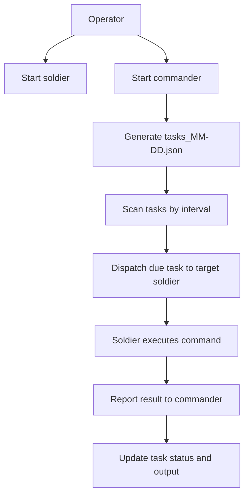

# HolyFramework

HolyFramework is a distributed task execution framework designed for enterprise intranet scenarios. The project uses `commander` to generate and schedule daily tasks, while `soldier` executes those tasks on different hosts and reports the results, continuously producing observable business traffic that resembles routine office activity.

The task-generation pipeline uses the DeepSeek API by default, but the invocation layer is abstracted in `commander/agent_request_abc.py` so that other model implementations can be added later. Domain scenarios, role responsibilities, and task templates are defined in `domain_resource.md`. Hard requirements for the generation prompt live in `task_generation_constraints.md`. Both are runtime resources read when building model prompts.

## What the Project Does

The goal of this project is to simulate a realistic small-enterprise intranet in which different roles perform routine, responsibility-appropriate tasks on different hosts, continuously generating normal and observable network activity.

Key features include:

- Automatically generates a daily task file, organizing a full day of tasks by role.
- Periodically scans the task schedule and dispatches due tasks to the corresponding hosts.
- Uses `soldier` to execute commands and report results to `commander`.
- Continuously writes task status, output, and error information back to the shared task file.
- Supports manual task generation, manual task dispatch, and manual result reporting.
- Dynamically defines the role set through `commander.ini`, where each section represents one role.
- Encapsulates model requests behind an abstract interface; the default implementation is currently `commander/deepseek_client.py`.

## Workflow



## Directory Structure

```text
HolyFramework/
├── README.md                              # Main project documentation and current entry point
├── common.py                              # Shared validation, path, task-format, and prompt utilities
├── domain_resource.md                     # Domain scenarios and task-template resource read at runtime
├── task_generation_constraints.md         # Hard-requirement prompt template read at runtime
├── requirements.txt                       # Python dependencies
├── skill/                                 # Per-role Skill bundles installed on role hosts
│   ├── accountancy-skills/                # Accountancy host Skills
│   ├── hr-skills/                         # HR host Skills
│   ├── manager-skills/                    # Manager host Skills
│   ├── programmer-skills/                 # Programmer host Skills
│   └── victim-skills/                     # Compromised-host adversary-emulation Skills
├── commander/
│   ├── commander.py                       # Main entry point: TCP server, scanner thread, and dependency wiring
│   ├── generate_role_task.py              # Standalone entry point for generating the daily task file
│   ├── dispatch.py                        # CLI for manually dispatching a single task
│   ├── dispatch_client.py                 # Subprocess adapter used by the scanner to invoke dispatch.py
│   ├── scanner_service.py                 # Main scanning and scheduling workflow
│   ├── role_file_service.py               # Daily task-file generation, repair, loading, and saving
│   ├── role_task_generation.py            # Task generation orchestration: prompt, model call, validation, and persistence
│   ├── agent_request_abc.py               # Abstract model-request interface and common response/exception types
│   ├── deepseek_client.py                  # Default model implementation: DeepSeek API client
│   ├── repository.py                      # Task-file repository: I/O, locking, and status updates
│   ├── domain.py                          # Task status-transition rules
│   ├── policies.py                        # Task-selection policies; selects the earliest pending task by default
│   ├── target_config.py                   # Loads roles and target-host configuration from commander.ini
│   ├── victim_campaign.py                 # On-demand victim campaign: one technique per step
│   ├── runtime_config.py                  # Loads and validates config.json
│   ├── logging_setup.py                   # Commander and dispatch logging setup
│   ├── config.json                        # Main commander configuration file
│   ├── commander.ini                      # Role-to-soldier host/port mapping
│   ├── role_task/                         # Directory containing shared daily task files
│   └── logs/                              # Commander and dispatch log directory
├── soldier/
│   ├── soldier.py                         # Main program: receives tasks, executes commands, and reports results
│   ├── soldier.ini                        # Soldier configuration file
│   └── logs/                              # Soldier log directory
└── tests/
    ├── test_commander_logging_hook.py     # Commander log-switch hook tests
    ├── test_commander_refactor.py         # Core commander regression tests
    ├── test_common_work_windows.py        # Shared work-window utility tests
    ├── test_role_dependency_provider.py   # Role dependency-provider tests
    ├── test_soldier_runtime.py             # Soldier runtime tests
    └── test_victim_campaign.py            # On-demand victim campaign state tests
```

## Core Concepts

### Commander

`commander` generates tasks, maintains daily task files, scans for due tasks, and dispatches them to the target `soldier`. It also receives execution results and writes their status back to the same task file.

### Soldier

`soldier` is the task execution endpoint. It listens for TCP requests from `commander`, executes the received commands, and then reports status, output, and error information back to `commander`.

### Shared Task File

Daily task files are stored at `commander/role_task/tasks_MM-DD.json` and organize tasks by role. Each task entry contains at least the following fields:

- `time`
- `is_load`
- `task`
- `task_id`
- `status`
- `issued_at`
- `expiry_time`
- `completed_at`
- `report_message`
- `exit_code`
- `stdout`
- `stderr`

Status transitions follow `planned -> waiting -> successed/failed`.

### Role Source

The role set is no longer hard-coded. Instead, it is derived from the sections in `commander/commander.ini`. For example:

```ini
[hr]
host = 192.168.14.72
port = 38472

[accountancy]
host = 192.168.14.73
port = 38472
```

This means:

- `hr` and `accountancy` are two role names.
- Each role maps to a target `soldier` host and listening port.
- To add or remove a role, only the sections in `commander.ini` need to be changed.

## Basic Usage

### 1. Environment Requirements

Install the base dependencies from `requirements.txt`:

```bash
pip install -r requirements.txt
```

The current Python dependencies are:

- `filelock>=3.13.0`
- `colorlog>=6.8.2`

You also need:

- Python 3.10+
- An executable `opencode` command available on the system
- Network connectivity between `commander` and every `soldier`

### 2. Configuration

Before running the project, review at least these three configuration files:

#### `commander/config.json`

This is the main `commander` configuration file. It controls listening, scanning, storage, dispatch, task generation, paths, and logging. The current default configuration includes:

- `commander` listens on `0.0.0.0:38471`
- Scan interval: `60` seconds
- Task generation uses DeepSeek by default:
  - `api_base_url`
  - `api_key`
  - `model`
  - `request_timeout_seconds`

Note: `generator.api_key` is sensitive information and should not be stored in plaintext in the repository long-term.

#### `commander/commander.ini`

Defines the mapping between roles and target hosts. Each section represents one role and must contain:

- `host`
- `port`

#### `soldier/soldier.ini`

Configures the `soldier` listening address, the `commander` address used for reporting, and the execution timeout:

```ini
[commander]
ip = 127.0.0.1
port = 38471

[listen]
bind = 0.0.0.0
port = 38472

[exec]
timeout = 900
```

### 3. Startup Order

Start `soldier` first, then start `commander`.

#### Start soldier

```bash
cd soldier
python soldier.py listen
```

Optional arguments:

```bash
python soldier.py listen --bind 0.0.0.0 --listen-port 38472 --commander-host 127.0.0.1 --commander-port 38471
```

#### Start commander

```bash
cd commander
python commander.py
```

Optional arguments:

```bash
python commander.py --host 0.0.0.0 --port 38471 --data-dir ./role_task --debug
```

By default, tasks wait until their planned time and are then dispatched in generated order,
regardless of how late they are. With `--debug`, tasks more than
`scanner.max_dispatch_lateness_minutes` late are marked failed instead of being dispatched.

### 4. Common Utility Commands

#### Manually generate the daily task file

```bash
cd commander
python generate_role_task.py
```

#### Manually dispatch a task

```bash
cd commander
python dispatch.py --target hr --command "opencode run \"Check email with Exchange\"" --task "Check email with Exchange"
```

#### On-demand victim campaign (not daily generation)

`victim` is excluded from the daily 35–42 task quota even if it appears in `commander.ini`. Run one technique at a time. Prefer `step` on the victim host so `~/.holyfw/campaign_state.json` is updated from OpenCode output:

```powershell
cd commander
python victim_campaign.py step --task "Use the penetration-test skill on the victim host, run observe for the reconnaissance phase, {run_id: recon-001, approved target: <DC_IP>, technique: domain users and trusts, traffic objective: LDAP queries to the approved DC, success criteria: sanitized user and trust counts saved, cleanup: not applicable}"
python victim_campaign.py show
python victim_campaign.py step
```

The second `step` (no `--task`) uses `next_task` from campaign state when the skill returned one after a privilege block or successful bounded step. From commander you can instead `python victim_campaign.py dispatch --task "..."` after enabling `[victim]` in `commander.ini`; the state file is still written on the victim by the skill.

Replace `<DC_IP>` with an operator-approved domain controller. Do not paste hashes or passwords into the task string.

#### Manually report a result from soldier

```bash
cd soldier
python soldier.py report --task-ref "2026-04-21_hr_a1b2c3d4e5f67890" --status successed --exit-code 0
```

#### View or lift character circuit breaker status

```powershell
cd commander
python breaker_control.py status
python breaker_control.py reset --role hr
```

#### Manually retry records that ultimately failed to report.

```powershell
cd soldier
python soldier.py replay-failed-reports
```

## Advanced Usage

## `commander/config.json` Parameters

### server

Controls the `commander` TCP listener:

- `host`: Listening address
- `port`: Listening port
- `max_line_bytes`: Maximum size in bytes of a single request
- `recv_chunk_bytes`: Chunk size for each socket read
- `socket_timeout_seconds`: Connection timeout
- `listen_backlog`: Listener backlog
- `worker_threads`: Maximum number of workers that handle `soldier` report connections; defaults to `6`

### scanner

Controls scanning behavior:

- `data_dir`: Shared task-file directory
- `scan_interval_seconds`: Scan interval in seconds

### storage

Controls task-file writes and output storage:

- `lock_timeout_seconds`: File-lock timeout
- `max_store_text`: Maximum number of characters stored for stdout/stderr

### dispatch

Controls task dispatch:

- `soldier_timeout_seconds`: TCP timeout used by `dispatch.py` when connecting to `soldier`
- `client_timeout_seconds`: Timeout for the `dispatch.py` subprocess invoked by `commander`; must be at least 5 seconds longer than `soldier_timeout_seconds`
- `timeout_minutes`: Waiting-expiration period written to a task after dispatch

### failure_policy

Limit consecutive failures by role：

- `cooldown_seconds`: The pause duration after the first and second failures; currently set to `300` seconds.
- `max_consecutive_failures`: The threshold for triggering the circuit breaker based on consecutive failures; currently set to `3`.
- `state_file`: The file used to persist the circuit breaker state; restarting Commander will not bypass the circuit breaker.

Once the threshold is reached, the role will not initiate new tasks for the remainder of the day. A `busy` status simply indicates that the Soldier has hit its concurrency limit and does not count as a failure; while a successful result resets the consecutive failure count, a triggered circuit breaker must be manually reset or will only clear upon the change of date.

### email_alert

An alert can be sent via QQ Mail SMTP when a role circuit-breaker trips. This feature is disabled by default; to enable it, you must:

1. Enable the SMTP service in your QQ Mail account and generate an authorization code.
2. Fill in the `sender` and `recipients` fields in `commander/config.json` and set `enabled=true`.
3. Store the authorization code in an environment variable rather than writing it to the configuration file:

```powershell
$env:HOLYFW_QQ_SMTP_AUTH_CODE = "Your QQ Mail SMTP authorization code"
```

By default, the system uses `smtp.qq.com:465` with SSL. Email delivery failures will not prevent the role circuit-breaker from tripping, nor will they trigger `opencode`.

### generator

Controls task generation:

- `min_tasks_per_role`: Minimum number of tasks per role
- `max_tasks_per_role`: Maximum number of tasks per role
- `min_non_five_ratio`: Minimum ratio of task times whose minute value is not a multiple of five
- `max_attempts`: Number of generation attempts
- `api_base_url`: Model API URL
- `api_key`: Model API key
- `model`: Model name
- `request_timeout_seconds`: Timeout for a single model request

### paths

Controls path resolution. Relative paths are resolved from the `commander/` directory:

- `logs_dir`
- `target_ini_file`
- `dispatch_script`
- `domain_resource_file`
- `task_generation_constraints_file`

For example, `domain_resource_file` currently defaults to `../domain_resource.md`, and `task_generation_constraints_file` defaults to `../task_generation_constraints.md`, so the root-level markdown resources are read during task generation.

### logging

Controls logging:

- `level`
- `backup_count`
- `rotation_interval_days`

## Advanced `commander.ini` Details

`commander.ini` is more than an address table: it also defines the role set itself.

`load_all_roles()` in `commander/target_config.py` reads every section name as a role, so:

- Adding a section adds a role.
- Removing a section removes that role from scheduling.
- Section names are normalized to lowercase.
- `victim` remains dispatchable but is omitted from daily task generation (`load_daily_generation_roles()`). Drive it with `victim_campaign.py`.

## Advanced `soldier.ini` Details

### commander Section

Determines which `commander` receives result reports from the `soldier`:

- `ip`
- `port`

### listen Section

Determines the address on which `soldier` receives tasks:

- `bind`
- `port`
- `worker_threads`：Maximum limit on concurrent active tasks; currently `3`. New tasks receive a `busy` response immediately upon reaching the limit.

For distributed deployments, ensure that `bind` is not limited to the local loopback address and that the port is reachable from the `commander` host.

### exec Section

Sets the timeout for a single command execution:

- `timeout`：单任务执行超时，当前为 `900` 秒；超时会终止 shell、opencode 和 node 的完整进程树

## Parameter Precedence and Overrides

### commander

`commander.py` supports the following overrides:

- `--host` overrides `server.host`
- `--port` overrides `server.port`
- `--data-dir` overrides `scanner.data_dir`
- `--debug` enables the configured dispatch-lateness window; without it, overdue tasks remain dispatchable

### dispatch

`dispatch.py` supports the following overrides:

- `--data-dir` overrides `scanner.data_dir`
- `--timeout-minutes` overrides `dispatch.timeout_minutes`
- `--config` overrides `paths.target_ini_file`

### soldier

Command-line arguments in `soldier.py` take precedence over `soldier.ini`:

- `--config`
- In `listen` mode: `--bind`, `--listen-port`, `--commander-host`, and `--commander-port`
- In `report` mode: `--host` and `--port`

## Model-Based Task Generation Pipeline

The current task-generation workflow is:

1. `commander/generate_role_task.py` or `RoleTaskFileService` triggers generation.
2. `commander/role_task_generation.py` reads `domain_resource.md` and `task_generation_constraints.md`, then constructs the prompt.
3. `commander/deepseek_client.py` calls the DeepSeek API through `DeepSeekAgentClient`.
4. The returned content is extracted as JSON, structurally validated, quality-checked, and then persisted as `tasks_MM-DD.json`.

In this design:

- `commander/agent_request_abc.py` defines the common model-request interface.
- `commander/deepseek_client.py` is the current default implementation.
- To add another model client, implement the interface and inject the new client; the main task-generation workflow does not need to be rewritten.

## Logs and Runtime Artifacts

### commander

Logs are stored in `commander/logs/`. Common files include:

- `commander_YYYY-MM-DD.log` (switches by calendar day: when the date changes, a periodic hook reattaches the root file logger to that day's file)
- `agent_responses_YYYY-MM-DD/` interactive AI logs named `{role}_attemptN_*_interactive.log` (one file per finished model interaction)

Format: `time - LEVEL - role[index] - message`. Production (`INFO`) records task start (`Running — <task_id>`) and end (`Success` / `Failed`). Pass `--debug` for detailed dispatch and scan process logs. Dispatch no longer writes a separate `dispatch_*.log`.

### soldier

All soldier observability logs live under `soldier/logs/`:

- `soldier_YYYY-MM-DD.log` — human-readable execution log (`time - LEVEL - task_id - message`), including receive time/content and finish status
- `tasks_YYYY-MM-DD.jsonl` — one JSON record per task with `received_at`, `command`, `status`, `exit_code`, `stdout`, and `stderr`

Operational state (not task logs) lives under `soldier/runtime/`:

- `task_state_MM-DD.jsonl` — idempotent execution state
- `pending_reports.jsonl` — reports waiting to retry to commander
- `failed_reports.jsonl` — reports that still failed after three retries

## Important Notes

- `domain_resource.md` and `task_generation_constraints.md` are runtime resources; do not delete them as though they were ordinary documentation.
- `soldier` executes received commands and should be deployed only in a controlled environment.
- In distributed deployments, carefully check the listening addresses, report-back addresses, and firewall configuration for `commander` and `soldier`.
- Task times are based on each host's system clock. Keep clocks synchronized across hosts in distributed deployments.
- Both `commander` and `soldier` use bounded thread pools for TCP processing, with a default maximum of 6 concurrent workers.
- Dispatch binds a task as `waiting` before sending it to `soldier`. If sending fails, the task is rolled back to a retryable state.
- `soldier` command output is truncated to the configured limit before being written to a report, preventing large stdout/stderr streams from exhausting memory.
- If `soldier` cannot report to `commander`, the report is added to a local queue and retried up to three times in the background.
- The generator uses the DeepSeek API by default. When changing model settings, also review the `generator` section in `commander/config.json`.

## Development and Regression Testing

Run full unittest discovery from the repository root:

```bash
python -m unittest discover -s tests -p "test*.py"
```

The tests cover core paths including the `commander` task repository, generation validation, dispatch rollback, log switching, `soldier` output truncation, and report retries. Network instability, real multi-host deployments, and system-level process supervision should still be validated through integration and operational exercises.

When extending the project, start with these entry points:

- `commander/commander.py`
- `commander/scanner_service.py`
- `commander/role_file_service.py`
- `commander/role_task_generation.py`
- `commander/agent_request_abc.py`
- `soldier/soldier.py`
