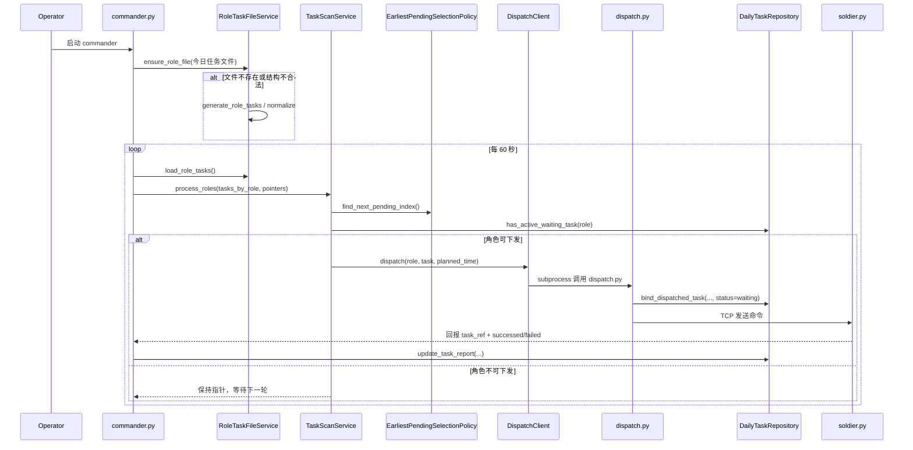

# HolyFramework - 分布式任务执行框架

## 项目结构

```
HolyFramework/
├── common.py                    # 共享函数库
├── domain_resource.md          # 共享领域资源文档
├── commander/                  # commander端（可独立部署）
│   ├── commander.py           # 主服务入口（TCP监听+装配）
│   ├── dispatch.py            # 手动任务分发入口
│   ├── repository.py          # 任务文件仓储层
│   ├── role_file_service.py   # 任务文件生成/修复服务
│   ├── scanner_service.py     # 扫描应用服务
│   ├── policies.py            # 任务选择策略
│   ├── domain.py              # 状态迁移规则
│   ├── dispatch_client.py     # 分发适配器
│   ├── logging_setup.py       # 日志初始化
│   ├── target_config.py       # 目标配置读取
│   ├── generate_role_task.py  # 独立任务生成脚本
│   ├── commander.ini          # commander配置
│   ├── README.md              # 使用文档
│   ├── ARCHITECTURE.md        # 架构图与模块依赖说明
│   ├── DEVELOPER_ONBOARDING.md # 开发者上手清单
│   ├── role_task/            # 统一任务目录（tasks_MM-DD.json）
│   └── logs/                  # commander日志
├── soldier/                   # soldier端（可独立部署）
│   ├── soldier.py            # 主服务
│   ├── soldier.ini           # soldier配置
│   ├── README.md             # 使用文档
│   ├── received_task_MM-DD.jsonl # 任务接收记录（运行时生成）
│   └── logs/                 # soldier日志
└── requirements.txt          # Python依赖
```

## 新功能：自动任务生成与分发

Commander 详细架构图与模块依赖说明见 `commander/ARCHITECTURE.md`。
开发者快速上手见 `commander/DEVELOPER_ONBOARDING.md`。
配置字段与覆盖规则见 `commander/CONFIG.md`。

### 新增特性

1. **自动任务生成**：每日生成统一任务文件（`tasks_MM-DD.json`）
2. **定时扫描**：commander每分钟检查并分发任务
3. **智能调度**：按时间顺序分发任务，控制并发

### 配置说明

#### commander.ini
```ini
[hr]
host = 127.0.0.1
port = 38472

[accountancy]
host = 127.0.0.1
port = 38472

[manager]      # 新增：总经理
host = 127.0.0.1
port = 38472

[programmer]   # it 与 developer 合并后角色
host = 127.0.0.1
port = 38472
```

#### soldier.ini（保持不变）
```ini
[commander]
ip = 127.0.0.1
port = 38471

[listen]
bind = 0.0.0.0
port = 38472

[exec]
timeout = 3600
```

## 启动方式

### 1. 独立部署（推荐）

#### 启动soldier（任务执行端）
```bash
cd soldier
python soldier.py listen
```

#### 启动commander（任务管理端）
```bash
cd commander
python commander.py
```

### 2. 手动生成任务（可选）
```bash
cd commander
python generate_role_task.py
```

### 3. 手动分发任务（可选）
```bash
cd commander
python dispatch.py --target=hr --command='opencode run "使用Exchange查看邮件"'
```

## 工作流程

1. **每日首次启动**：自动生成 `tasks_MM-DD.json` 统一任务文件
2. **定时扫描**：每分钟检查任务计划，按时间分发
3. **任务执行**：soldier接收任务并执行 `opencode run` 命令
4. **状态报告**：soldier向commander报告执行结果
5. **状态跟踪**：commander在同一文件内更新任务状态

## 程序执行时序图



## 任务文件格式

### 统一任务文件（role_task/tasks_MM-DD.json）
```json
{
  "hr": [
    {
      "time": "09:15",
      "is_load": false,
      "task": "使用Exchange查看邮件",
      "task_id": "hex_uuid",
      "status": "waiting|successed|failed",
      "issued_at": "ISO时间戳",
      "expiry_time": "ISO时间戳",
      "completed_at": "ISO时间戳（完成时）",
      "stdout": "标准输出",
      "stderr": "标准错误"
    }
  ],
  "accountancy": [...],
  "manager": [...],
  "programmer": [...]
}
```

说明：任务文本字段统一使用 `task`，不再使用 `description`。

## 错误处理

- **任务生成失败**：重试3次，使用备用模板
- **网络异常**：指数退避重试
- **文件损坏**：删除并重新生成
- **日期变更**：自动重置指针，加载新文件

## 监控与日志

- **日志位置**：各组件目录下的 `logs/` 子目录
- **日志轮转**：每日轮转，保留7天
- **数据清理**：自动清理20天前的文件

## 依赖要求

- Python 3.8+
- `filelock` 包（`pip install filelock`）
- `opencode` CLI（已在系统PATH中）

## 注意事项

1. 确保 `opencode` CLI 在系统PATH中
2. 首次运行时自动创建所需目录
3. 分布式部署时修改配置文件中的主机地址
4. 任务时间基于系统时钟，确保时间同步