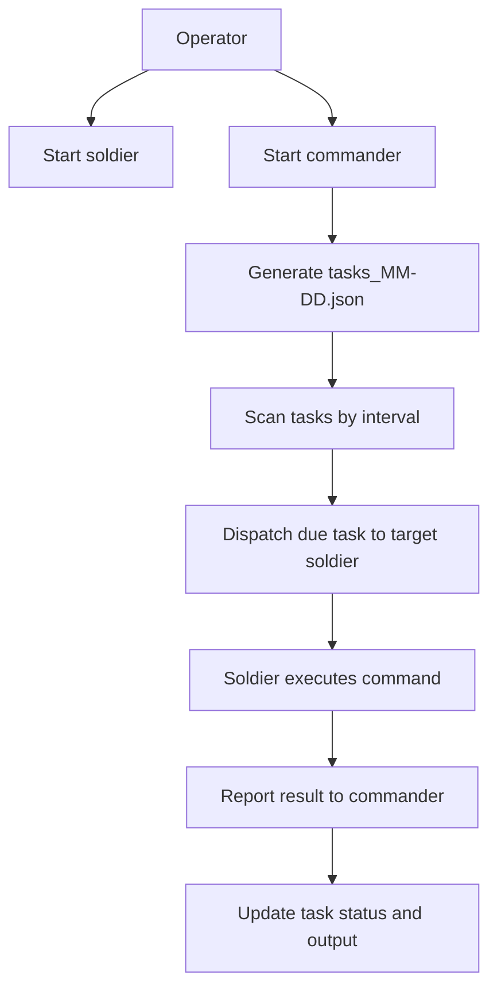

# HolyFramework

HolyFramework is a distributed task execution framework designed for enterprise intranet scenarios. The project uses `commander` to generate and schedule daily tasks, while `soldier` executes those tasks on different hosts and reports the results, continuously producing observable business traffic that resembles routine office activity.

The task-generation pipeline uses the DeepSeek API by default, but the invocation layer is abstracted in `common/agent_request_abc.py` so that other model implementations can be added later. Domain scenarios, role responsibilities, and task templates are defined in `domain_resource.md`. Hard requirements for the generation prompt live in `task_generation_constraints.md`. Both are runtime resources read when building model prompts.

## What the Project Does

The goal of this project is to simulate a realistic small-enterprise intranet in which different roles perform routine, responsibility-appropriate tasks on different hosts, continuously generating normal and observable network activity.

Key features include:

- Automatically generates a daily task file, organizing a full day of tasks by role.
- Periodically scans the task schedule and dispatches due tasks to the corresponding hosts.
- Uses `soldier` to execute commands and report results to `commander`.
- Continuously writes task status, output, and error information back to the shared task file.
- Supports manual task generation, manual task dispatch, and manual result reporting.
- Dynamically defines the role set through `commander.ini`, where each section represents one role.
- Encapsulates model requests behind an abstract interface; the default implementation is currently `common/deepseek_client.py`.

## Workflow



## Directory Structure

```text
HolyFramework/
├── README.md                              # Main project documentation and current entry point
├── llm.json                               # LLM provider catalog (base_url, models, env, enable)
├── common/                                # Shared path, task-format, time-model, and LLM client utilities
│   ├── __init__.py                        # Validation, workspace paths, and task-file helpers
│   ├── time_model.py                      # Thesis 3.4 NHPP schedule generator
│   ├── agent_request_abc.py               # Abstract model-request interface
│   ├── deepseek_client.py                 # OpenAI-compatible LLM client
│   ├── llm_catalog.py                     # Load and validate root llm.json
│   └── user_env.py                        # Windows user-level environment variables
├── domain_resource.md                     # Domain scenarios and task-template resource read at runtime
├── task_generation_constraints.md         # Hard-requirement prompt template read at runtime
├── requirements.txt                       # Python dependencies
├── role_profiles/                         # Bundled OpenCode config, AGENTS.md, and office/victim skill packs
│   ├── opencode.json                      # MCP servers and permissions (no custom LLM providers)
│   ├── AGENTS.md                          # Role-stamped OpenCode agent rules
│   ├── accountancy-skills/                # Accountancy host Skills
│   ├── hr-skills/                         # HR host Skills
│   ├── manager-skills/                    # Manager host Skills
│   └── programmer-skills/                 # Programmer host Skills
├── commander/
│   ├── host_build.py                      # commander build: overwrite provider env-key config and clear OpenCode cache
│   ├── opencode.json                      # commander build: DeepSeek provider env-key placeholder only
│   ├── commander.py                       # Main entry point: TCP server, scanner thread, and dependency wiring
│   ├── generate_role_task.py              # Standalone entry point for generating the daily task file
│   ├── dispatch.py                        # CLI for manually dispatching a single task
│   ├── config_control.py                  # commander config --api-key: local llm.json/env; --sync fans out
│   ├── dispatch_client.py                 # Subprocess adapter used by the scanner to invoke dispatch.py
│   ├── scanner_service.py                 # Main scanning and scheduling workflow
│   ├── role_file_service.py               # Daily task-file generation, repair, loading, and saving
│   ├── prompt_catalog.py                  # Assembles domain/role/skills/context prompts
│   ├── prompt_resources/                  # Compact generation catalog (not full SKILL.md bodies)
│   ├── role_task_generation.py            # Task generation: ReAct parse, zip times, validate
│   ├── repository.py                      # Task-file repository: I/O, locking, and status updates
│   ├── domain.py                          # Task status-transition rules
│   ├── policies.py                        # Task-selection policies; selects the earliest pending task by default
│   ├── target_config.py                   # Loads roles and target-host configuration from commander.ini
│   ├── victim_campaign.py                 # On-demand victim campaign: one technique per step
│   ├── runtime_config.py                  # Loads and validates config.json
│   ├── logging_setup.py                   # Commander and dispatch logging setup
│   ├── config.json                        # Main commander configuration file
│   ├── commander.ini                      # Role-to-soldier host/port mapping
│   ├── role_task/                         # Directory containing shared daily task files
│   └── logs/                              # Commander and dispatch log directory
├── attacker/
│   ├── cli.py                             # Default command starts the attacker scheduler; attacker config --api-key
│   ├── config_control.py                  # attacker config --api-key: llm.json + user env (no soldier fan-out)
│   ├── runtime.py                         # NHPP schedule, batch-of-5 fill, serial local execution
│   ├── generation.py                      # LLM batch requests using skill prompts and state.json
│   ├── execute.py                         # Local opencode run plus per-task Markdown transcript
│   ├── task_file.py                       # Attacker task-list JSON schema
│   ├── task_record.py                     # Markdown transcript writer
│   ├── breaker.py                         # attacker breaker reset: task file and/or state.json
│   ├── AGENTS.md                          # Attacker OpenCode rules
│   ├── opencode.json                      # Attacker permission only (no MCP, no custom LLM providers)
│   ├── generator_system.md                # Task-generation system prompt
│   ├── attacker_prompt_template.md        # Task-string grammar for the generator
│   ├── skills/ad-attack/                  # Attacker OpenCode skill pack
│   ├── config.json                        # Time model, batch size, and model settings
│   ├── role_task/                         # Daily attacker task lists
│   └── logs/                              # Scheduler log plus dated dataset folders
├── soldier/
│   ├── soldier.py                         # Main program: receives tasks, executes commands, and reports results
│   ├── soldier.ini                        # Soldier configuration file
│   ├── logs/                              # soldier_YYYY-MM-DD.log lifecycle files
│   └── runtime/                           # Task Markdown transcripts and report queues
└── tests/
    ├── test_attacker_runtime.py           # Attacker batch fill, serial execution, and result logs
    ├── test_commander_logging_hook.py     # Commander log-switch hook tests
    ├── test_commander_refactor.py         # Core commander regression tests
    ├── test_llm_config.py                 # llm.json enable invariant, local config, --sync fan-out, soldier apply
    ├── test_common_work_windows.py        # Shared work-window utility tests
    ├── test_role_dependency_provider.py   # Role dependency-provider tests
    ├── test_soldier_runtime.py             # Soldier runtime tests
    └── test_victim_campaign.py            # On-demand victim campaign state tests
```

## Core Concepts

### Commander

`commander` generates tasks, maintains daily task files, scans for due tasks, and dispatches them to the target `soldier`. It also receives execution results and writes their status back to the same task file.

### Soldier

`soldier` is the task execution endpoint. It listens for TCP requests from `commander`, executes the received commands, and then reports status, output, and error information back to `commander`.

### Attacker

`attacker` is a standalone scheduler on the attacker host. It uses the same NHPP time-node model as office roles, writes a day's task list, asks the model for at most five task strings at a time, and runs due tasks locally with `opencode run --auto`. It does not go through commander dispatch. Install skills first with `attacker build`. Scheduler progress is written to the console and to `attacker/logs/attacker_YYYY-MM-DD.log`.

Each attacker task object has:

- `task_id`
- `task`
- `planned_time`
- `started_at`
- `completed_at`

Per-task OpenCode transcripts and capture files live under `attacker/logs/YYYY-MM-DD/`: `{task_id}.md`, `{task_id}_{technique}.pcapng`, and `{task_id}_{technique}_{channel}.evtx`.

### Shared Task File

Daily task files are stored at `commander/role_task/tasks_MM-DD.json` and organize tasks by role. Each task entry contains at least the following fields:

- `time`
- `is_load`
- `task`
- `task_id` (assigned when the daily file is generated, not at dispatch)
- `status`
- `issued_at`
- `expiry_time`
- `completed_at`
- `report_message`
- `exit_code`

Status transitions follow `planned -> waiting -> successed/failed`. `task_id` is unique across days; commander looks up reports by that ID if the date in `task_ref` does not match the task file. Task output stays on the soldier host (OpenCode session); reports to commander carry only status, exit code, and an optional message.

### Role Source

The role set is no longer hard-coded. Instead, it is derived from the sections in `commander/commander.ini`. For example:

```ini
[hr]
host = 192.168.14.72
port = 38472

[accountancy]
host = 192.168.14.73
port = 38472
```

This means:

- `hr` and `accountancy` are two role names.
- Each role maps to a target `soldier` host and listening port.
- To add or remove a role, only the sections in `commander.ini` need to be changed.

## Basic Usage

### 1. Environment Requirements

Install the project from the repository root (dependencies are declared in `pyproject.toml`):

```bash
pip install .
```

For local development, use an editable install:

```bash
pip install -e .
```

This provides the `commander`, `soldier`, and `attacker` commands. Python dependencies are `filelock`, `colorlog`, and `matplotlib`.

You also need:

- Python 3.10+
- Node.js / `npx` on each soldier host (`soldier build` installs Playwright through npx)
- An executable `opencode` command available on the system
- Network connectivity between `commander` and every `soldier`

### 2. Configuration

Before running the project, review at least these configuration files:

#### `llm.json`

Root-level LLM catalog. There is no hardcoded vendor set: each key under `provider` is a vendor id passed to OpenCode as `--model {provider}/{models}`. Add another vendor by adding an object with `base_url`, `models`, `env`, and `enable`. Exactly one provider must have `"enable": true`. The API key is never stored here. A name ending in `-proxy` is a custom OpenAI-compatible proxy: commander generation still POSTs to that entry's `base_url`, and each `config` / `llm_config` replace of `~/.config/opencode/opencode.json` `provider` writes `npm`, `options.baseURL`, `options.apiKey` as `{env:<catalog env>}`, and the catalog model. Other names write only `{env:...}` (no `baseURL`, no `npm`) so OpenCode uses its built-in endpoint. Every apply replaces the entire `provider` object so leftover vendor blocks cannot remain. Soldier `build` writes permission and MCP only. By default `commander config` only updates this host. With `--sync` it also pushes `llm_config`; each soldier overwrites its workspace `llm.json` with the commander's file, then binds OpenCode from the overwritten enable entry. `attacker config` does the same local apply on the attacker host and never contacts soldiers.

Commander generation POSTs to the `enable: true` entry's `base_url` using that entry's `models`. Built-in vendors append `/chat/completions` when it is missing; a name ending in `-proxy` is posted as written (no path join). Soldier only passes `--model {provider}/{model}` to `opencode run`; OpenCode switches the vendor endpoint from that spec (see [OpenCode CLI](https://opencode.ai/docs/zh-cn/cli/#run-1)). `--api-key` is required; `--llm-provider` and `--model` are optional and default to the current `enable: true` entry. `--sync` is a flag (default off); if present, commander also fans the catalog and key out to soldiers:

```bash
commander config --api-key <secret>
commander config --llm-provider zhipu --api-key <secret>
commander config --llm-provider zhipu --api-key <secret> --model GLM-4.7-Flash
commander config --llm-provider zhipu --api-key <secret> --sync
```

That command updates workspace `llm.json` enable/models (exactly one `enable: true`), writes the selected provider's API-key env var, and points OpenCode at that env name in `~/.config/opencode/opencode.json`. `--sync` additionally pushes the commander workspace `llm.json` plus the API key to every soldier. Each soldier overwrites its own workspace `llm.json` with that file (no local catalog lookup) and writes the `{env:...}` binding from the overwritten enable entry into its OpenCode config. After `commander config`, restart a long-running `commander` so generation re-reads `llm.json`. After updating soldier code, restart `soldier listen` on every role host before `--sync`; an old listen process treats config as a task and returns `Missing or invalid task_ref`.

#### `commander/config.json`

This is the main `commander` configuration file. It controls listening, scanning, storage, dispatch, task generation, paths, and logging. The current default configuration includes:

- `commander` listens on `0.0.0.0:38471`
- Scan interval: `60` seconds
- Task generation POSTs to the `llm.json` `enable: true` entry (`base_url` and `models`). Timeout and token limits still come from `generator` in `config.json` (`request_timeout_seconds`, `max_tokens`). `generator.api_base_url` / `generator.model` are leftover fields and are not used for the HTTP request.

The API key is read from the user-level environment variable named by `llm.json` (`env` on the enabled provider). It is not stored in `commander/config.json` or `llm.json`. `commander build` writes `{env:...}` placeholders into `~/.config/opencode/opencode.json` from `commander/opencode.json`. See `commander config` and the generator section below.

#### `commander/commander.ini`

Defines the mapping between roles and target hosts. Each section represents one role and must contain:

- `host`
- `port`

Optional time-model keys overlay `generator.time_model` in `config.json` per role (`tasks_per_role`, peak/width/AR(1) parameters). Omitted keys use the JSON defaults. `avoid_five_minutes` is JSON-only.

#### `soldier/soldier.ini`

Configures the `soldier` listening address, the `commander` address used for reporting, and the execution timeout:

```ini
[commander]
ip = 127.0.0.1
port = 38471

[listen]
bind = 0.0.0.0
port = 38472

[exec]
timeout = 900
```

### 3. Startup Order

Start `soldier` first, then start `commander`. After `pip install .` the commands are:

#### Install OpenCode skills/MCP on a soldier host

Run once per role host. Copies that role's skills from `role_profiles/<role>-skills/` into `~/.config/opencode/skills/` (overwriting existing skill directories). Deletes any existing `~/.config/opencode/opencode.json` and `opencode.jsonc`, then writes a fresh `opencode.json` from the bundled template (`permission` and MCP servers only; no custom LLM `provider` block). Also writes a role-stamped `~/.config/opencode/AGENTS.md`, stops leftover `opencode.exe`, and deletes OpenCode runtime state: `%USERPROFILE%\.cache\opencode`, `%USERPROFILE%\.local\share\opencode`, `%LOCALAPPDATA%\opencode` if present, and `auth.json` under the config and data dirs. Installs Playwright Chromium if `npx playwright` is missing. Soldier then runs tasks as `opencode run --auto` with `OPENCODE_PERMISSION` set so workspace-outside paths (Desktop, UNC shares) do not wait for Enter. Do not leave an old `opencode serve` process attached to these hosts; each task starts a fresh `opencode run`.

```bash
soldier build hr
soldier build hr --test
```

`--test` runs after a successful install. It checks that OpenCode loads (`opencode --version` and `~/.config/opencode/opencode.json`), that each installed skill and bundled MCP is present, then runs `opencode run --auto` with one representative prompt per skill and per MCP (same argv and `OPENCODE_PERMISSION` as production). Prompts are taken from `role_profiles/<role>-skills/PROMPT_TEMPLATES.md`, preferring view/list/search/extract examples when they exist. Skills without an `opencode run` example (for example `pdf`) are skipped. Progress is printed per case as it starts (`[N/M] Target`, `Command`, then `Result`); if a live prompt appears stuck, the last Target/Command is the current task. Output is terminal-only; nothing is written under soldier `runtime/` or log files. Each live prompt can take up to 900 seconds. A failed check leaves the installed config in place and exits 1.

Roles: `hr`, `accountancy`, `manager`, `programmer`, `victim`.

#### Install OpenCode skills on an attacker host

Copies skills from `attacker/skills/` into `~/.config/opencode/skills/`, writes `~/.config/opencode/opencode.json` from `attacker/opencode.json` (permission only; no MCP and no custom LLM `provider` block), and writes `~/.config/opencode/AGENTS.md` from `attacker/AGENTS.md`. Stops leftover `opencode.exe` and deletes the same OpenCode runtime cache/data/`auth.json` paths as `soldier build`. Does not install Playwright. Run once on the attacker host:

```bash
attacker build
attacker build --test
```

`--test` checks that OpenCode loads and runs the `ad-attack` representative prompt (`discovery.orientation`). `soldier build attacker` is rejected; soldier is for office roles and victim only.

#### Write DeepSeek provider env-key config on the commander host

Does not install skills, `AGENTS.md`, Playwright, or MCP servers. Deletes any existing `~/.config/opencode/opencode.json` and `opencode.jsonc`, then writes a fresh `opencode.json` from `commander/opencode.json` that contains only `provider.deepseek.options.apiKey` (`{env:DEEPSEEK_API_KEY}`). Stops leftover `opencode.exe` and deletes the same OpenCode runtime cache/data/`auth.json` paths as `soldier build`. The process still needs `DEEPSEEK_API_KEY` set at runtime.

```bash
commander build
commander build --test
```

`commander build --test` only checks that OpenCode starts and that the DeepSeek provider can complete a short smoke prompt. It does not install or exercise skills or MCP servers.

#### Set the LLM API key (and optionally provider/model)

`--api-key` is required. `--llm-provider` and `--model` default to the current `llm.json` enable entry. By default `commander config` only writes this host's `llm.json`, user env, and a full replace of the OpenCode `provider` block (`-proxy` names include `baseURL`; others do not). Pass `--sync` to also push the commander workspace `llm.json` plus the API key to soldiers (each soldier overwrites its catalog, then replaces `provider` from the overwritten enable entry). `attacker config` uses the same `--api-key` / `--llm-provider` / `--model` flags and the same workspace `llm.json`, but has no `--sync` and does not contact soldiers. The key is never written to JSON. Restart a long-running `commander` or `attacker` after config so it re-reads `llm.json`. Update and restart `soldier listen` on all role hosts before `--sync`; otherwise old processes return `Missing or invalid task_ref`.

```bash
commander config --api-key <secret>
commander config --llm-provider zhipu --api-key <secret> --model GLM-4.7-Flash
commander config --llm-provider zhipu --api-key <secret> --sync
attacker config --api-key <secret>
attacker config --llm-provider zhipu --api-key <secret> --model GLM-4.7-Flash
```

#### Start soldier

```bash
soldier listen
```

Optional arguments:

```bash
soldier listen --bind 0.0.0.0 --listen-port 38472 --commander-host 127.0.0.1 --commander-port 38471
```

On Windows, `soldier listen` does not start Sysmon collection. Log collection is manual-only so `soldier` can start cleanly from a normal user session. The `--no-sysmon` flag is accepted for compatibility but has no effect.

#### Collect Sysmon logs

Prerequisite on each host that should record Sysmon events: Sysmon is already installed and running. The collector does not restart Sysmon; it records an observe timestamp and waits. Run it manually from an Administrator PowerShell when logs are needed:

```bash
sysmon-collect
python -m sysmon_collector
```

At local 00:00 the collector exports the previous 24 hours under `soldier/logs/sysmon/` (override with `HOLYFW_SYSMON_LOG_DIR`):

- `sysmon_YYYY-MM-DD.evtx` — Sysmon Operational
- `security_logon_YYYY-MM-DD.evtx` — Security logon and authentication events (4624/4625/4768/4776 and related IDs)

If Sysmon is not running when observed, midnight export still continues for both channels.

#### Start commander

```bash
commander
```

Optional arguments:

```bash
commander --host 0.0.0.0 --port 38471 --data-dir ./role_task --debug
```

Without installing, from the repository root:

```bash
python soldier/soldier.py listen
python commander/commander.py
python -m attacker.cli
```

By default, tasks wait until their planned time and are then dispatched in generated order,
regardless of how late they are. With `--debug`, tasks more than
`scanner.max_dispatch_lateness_minutes` late are marked failed instead of being dispatched.

#### Start attacker

On the attacker host, install skills once with `attacker build`, set the LLM key with the same flags as commander, then start the scheduler. HTTP generation and `opencode run --model` both follow workspace `llm.json` (`enable: true`). With no subcommand it runs immediately, same as `attacker run`:

```bash
attacker build
attacker config --llm-provider zhipu --api-key <secret>
attacker
```

`attacker` samples the day's time nodes, writes `attacker/role_task/tasks_MM-DD.json`, requests up to five task strings from the model whenever no filled task is waiting, and executes due or overdue tasks serially with local `opencode run --auto`. Inspect the list with `attacker show`.

`base_time` (0–23) shifts the generated 09:00 workday the same way commander does. Set it in `attacker/config.json` or pass `--base-time` (`attacker --base-time 21`). Times that wrap past midnight stay on the next calendar day and are not treated as already due.

```powershell
attacker breaker reset --all
attacker breaker reset --task
```

`attacker breaker reset --all` (also the default if you omit `--all` / `--task`) deletes today's `attacker/role_task/tasks_MM-DD.json` and rewrites `state.json` plus `changes.json` to empty baselines in both the packaged skill and `~/.config/opencode/skills/ad-attack/` when those directories exist. It does **not** revert Active Directory; use `changes.json` as the operator checklist. `attacker breaker reset --task` only deletes the day's task file. Pass `--date YYYY-MM-DD` to target another calendar day.

### 4. Common Utility Commands

#### Manually generate the daily task file

```bash
commander generate
```

#### Manually dispatch a task

```bash
commander dispatch --target hr --task "Check email with Exchange"
```

#### On-demand victim campaign (not daily generation)

`victim` is excluded from the daily `tasks_per_role` quota even if it appears in `commander.ini`. Run one technique at a time. Prefer `step` on the victim host so `~/.holyfw/campaign_state.json` is updated from OpenCode output:

```powershell
commander victim step --task "Use the penetration-test skill on the victim host, run observe for the reconnaissance phase, {run_id: recon-001, approved target: <DC_IP>, technique: domain users and trusts, traffic objective: LDAP queries to the approved DC, success criteria: sanitized user and trust counts saved, cleanup: not applicable}"
commander victim show
commander victim step
```

The second `step` (no `--task`) uses `next_task` from campaign state when the skill returned one after a privilege block or successful bounded step. From commander you can instead `commander victim dispatch --task "..."` after enabling `[victim]` in `commander.ini`; the state file is still written on the victim by the skill.

Replace `<DC_IP>` with an operator-approved domain controller. Do not paste hashes or passwords into the task string.

#### Manually report a result from soldier

```bash
soldier report --task-ref "2026-04-21_hr_a1b2c3d4e5f67890" --status successed --exit-code 0
```

#### Reset today's commander run

```powershell
commander breaker reset
```

`breaker reset` deletes today's `tasks_MM-DD.json` (and generation leftovers), truncates `commander/logs/commander_YYYY-MM-DD.log`, and removes `agent_responses_YYYY-MM-DD`. It does not generate tasks. A running commander generation loop will recreate the daily file afterward.

#### Manually retry records that ultimately failed to report.

```powershell
soldier replay-failed-reports
```

## Advanced Usage

## `commander/config.json` Parameters

### server

Controls the `commander` TCP listener:

- `host`: Listening address
- `port`: Listening port
- `max_line_bytes`: Maximum size in bytes of a single request
- `recv_chunk_bytes`: Chunk size for each socket read
- `socket_timeout_seconds`: Connection timeout
- `listen_backlog`: Listener backlog
- `worker_threads`: Maximum number of workers that handle `soldier` report connections; defaults to `6`

### scanner

Controls scanning behavior:

- `data_dir`: Shared task-file directory
- `scan_interval_seconds`: Scan interval in seconds

### storage

Controls task-file writes and output storage:

- `lock_timeout_seconds`: File-lock timeout
- `max_store_text`: Legacy field; commander no longer stores soldier process output

### dispatch

Controls task dispatch:

- `soldier_timeout_seconds`: TCP timeout used by `dispatch.py` when connecting to `soldier`
- `client_timeout_seconds`: Timeout for the `dispatch.py` subprocess invoked by `commander`; must be at least 5 seconds longer than `soldier_timeout_seconds`
- `timeout_minutes`: Waiting-expiration period written to a task after dispatch

### generator

Controls retry/timeout for task generation (`max_attempts`, `request_timeout_seconds`, `max_tokens`). Runtime `base_url` and model name come from the enabled provider in `llm.json`, not from `generator.api_base_url` / `generator.model`. Commander logs `LLM provider=... model=... base_url=...` at startup, on each generate, and in `agent_responses_*/` interactive files.

The API key is not stored in `config.json` or `llm.json`. Set it with:

```bash
commander config --api-key <secret>
```

Optional `--llm-provider` and `--model` select a catalog entry and model (only `--api-key` is required). That flips `llm.json` enable/models and writes the selected provider's API-key env var. Pass `--sync` to also push the commander workspace `llm.json` plus the API key to soldiers. If the API-key variable is missing or blank, Python client construction fails with an error naming that variable.

### paths

Controls path resolution. Relative paths are resolved from the `commander/` directory:

- `logs_dir`
- `target_ini_file`
- `dispatch_script`
- `domain_resource_file`
- `task_generation_constraints_file`

For example, `domain_resource_file` currently defaults to `../domain_resource.md`, and `task_generation_constraints_file` defaults to `../task_generation_constraints.md`, so the root-level markdown resources are read during task generation.

### logging

Controls logging:

- `level`
- `backup_count`
- `rotation_interval_days`

## Advanced `commander.ini` Details

`commander.ini` is more than an address table: it also defines the role set itself.

`load_all_roles()` in `commander/target_config.py` reads every section name as a role, so:

- Adding a section adds a role.
- Removing a section removes that role from scheduling.
- Section names are normalized to lowercase.
- `victim` and `attacker` remain omitted from daily office-role generation (`load_daily_generation_roles()`). Drive victim with `victim_campaign.py`. Drive attacker with the `attacker` command.

## Advanced `soldier.ini` Details

### commander Section

Determines which `commander` receives result reports from the `soldier`:

- `ip`
- `port`

### listen Section

Determines the address on which `soldier` receives tasks:

- `bind`
- `port`
- `worker_threads`：Maximum limit on concurrent active tasks; currently `3`. New tasks receive a `busy` response immediately upon reaching the limit.

For distributed deployments, ensure that `bind` is not limited to the local loopback address and that the port is reachable from the `commander` host.

### exec Section

Sets the timeout for a single command execution:

- `timeout`：单任务执行超时，当前为 `900` 秒；超时会终止 shell、opencode 和 node 的完整进程树

## Parameter Precedence and Overrides

### commander

`commander.py` supports the following overrides:

- `--host` overrides `server.host`
- `--port` overrides `server.port`
- `--data-dir` overrides `scanner.data_dir`
- `--debug` enables the configured dispatch-lateness window; without it, overdue tasks remain dispatchable

### dispatch

`dispatch.py` supports the following overrides:

- `--data-dir` overrides `scanner.data_dir`
- `--timeout-minutes` overrides `dispatch.timeout_minutes`
- `--config` overrides `paths.target_ini_file`

### soldier

Command-line arguments in `soldier.py` take precedence over `soldier.ini`:

- `--config`
- In `listen` mode: `--bind`, `--listen-port`, `--commander-host`, and `--commander-port`
- In `report` mode: `--host` and `--port`

## Model-Based Task Generation Pipeline

The current task-generation workflow is:

1. `common/time_model.py` samples a strictly increasing work-window schedule from the thesis 3.4 NHPP (dual Gaussian intensity, lunch mask, AR(1) busyness). `tasks_per_role` is the expected daily count E[N]; the realized list length is random.
2. `commander/role_task_generation.py` counts that list, then builds a ReAct prompt from `commander/prompt_resources/` (domain, role skills, env, schedule, backward facts) with `task_count = len(schedule)`.
3. The LLM returns exactly that many English task bodies and must not invent timestamps. Output is `Thought` then `Action: Finish` plus JSON.
4. Commander zips algorithm times onto the task list, validates content and cross-role response order, and persists `tasks_MM-DD.json`.

Working hours are 09:00-12:00 and 13:00-18:00 (lunch 12:00-13:00). Backward items use `{from, to, time, task}` where exactly one endpoint is the role being generated.

In this design:

- `common/agent_request_abc.py` defines the common model-request interface.
- `common/deepseek_client.py` is the current default implementation.
- To add another model client, implement the interface and inject the new client; the main task-generation workflow does not need to be rewritten.

## Logs and Runtime Artifacts

### commander

Logs are stored in `commander/logs/`. Common files include:

- `commander_YYYY-MM-DD.log` (switches by calendar day: when the date changes, a periodic hook reattaches the root file logger to that day's file)
- `agent_responses_YYYY-MM-DD/` interactive AI logs named `{role}_attemptN_*_interactive.log` (one file per finished model interaction)

Format: `time - LEVEL - role[index] - message`. Production (`INFO`) records task start (`Running — <task_id>`) and end (`Success` / `Failed`). Pass `--debug` for detailed dispatch and scan process logs. Dispatch no longer writes a separate `dispatch_*.log`.

### soldier

File logs live under `soldier/logs/`; per-task transcripts live under `soldier/runtime/`:

- `soldier_YYYY-MM-DD.log` — lifecycle log (`time - LEVEL - task_id - message`): receive time, start time, full `opencode run --auto ...` command, finish time, outcome (`Success` / `Fail` / `Error`), a short OpenCode output preview on Fail/Error, report time, and report result (`ok`, `queued: ...`, or `send failed: ...`)
- Console — only `Received` plus the outcome: `Success` (INFO), `Fail` with reason and output preview (WARNING, OpenCode started but non-zero or timeout), `Error` with the exception (ERROR, soldier could not start OpenCode)
- `runtime/tasks/YYYY-MM-DD/<task_id>.md` — Markdown record with YAML-like frontmatter, the Command section, and an Output section with the OpenCode transcript (JSONL rendered to text). The date folder is the `task_ref` date. Soldier still claims by `task_id` across dates.

Operational state (not the per-task transcript) also lives under `soldier/runtime/`:

- `pending_reports.jsonl` — reports waiting to retry to commander
- `failed_reports.jsonl` — reports that still failed after three retries

### attacker

Attacker records live under `attacker/logs/`:

- `attacker_YYYY-MM-DD.log` — scheduler log (`time - LEVEL - logger - message`) for fill, wait, execute, and completion
- `YYYY-MM-DD/<task_id>.md` — Markdown transcript with YAML-like frontmatter and literal stdout/stderr (not JSON-escaped)
- `YYYY-MM-DD/<task_id>_<technique>.pcapng` and `<task_id>_<technique>_{Sysmon,Security}.evtx` — capture dataset for that task
- `attacker/skills/ad-attack/changes.json` (and the installed OpenCode copy) — ledger of target-domain mutations for manual rollback; `attacker breaker reset --all` empties it together with `state.json`

## Important Notes

- `domain_resource.md` and `task_generation_constraints.md` are runtime resources; do not delete them as though they were ordinary documentation.
- `soldier` executes received commands and should be deployed only in a controlled environment.
- In distributed deployments, carefully check the listening addresses, report-back addresses, and firewall configuration for `commander` and `soldier`.
- Task times are based on each host's system clock. Keep clocks synchronized across hosts in distributed deployments.
- Both `commander` and `soldier` use bounded thread pools for TCP processing, with a default maximum of 6 concurrent workers.
- Dispatch binds a task as `waiting` before sending it to `soldier`. If sending fails, the task is rolled back to a retryable state.
- If `soldier` cannot report to `commander`, the report is added to a local queue and retried up to three times in the background.
- The generator POSTs to the `llm.json` `enable: true` `base_url` / `models`. Set the key with `commander config --api-key` (optional `--llm-provider` / `--model`). Add `--sync` when soldiers should receive the same catalog and key. Restart a long-running `commander` afterward. After updating soldier, restart `soldier listen` on every role host so `--sync` is not treated as a task. Soldier and attacker `build` still rewrite `~/.config/opencode/opencode.json` without a provider block; the next `config` / `llm_config` replaces `provider` for the selected vendor (`-proxy` names get `baseURL`, others do not).

## Development and Regression Testing

Run full unittest discovery from the repository root:

```bash
python -m unittest discover -s tests -p "test*.py"
```

The tests cover core paths including the `commander` task repository, generation validation, dispatch rollback, log switching, `soldier` output truncation, and report retries. Network instability, real multi-host deployments, and system-level process supervision should still be validated through integration and operational exercises.

When extending the project, start with these entry points:

- `commander/commander.py`
- `commander/scanner_service.py`
- `commander/role_file_service.py`
- `common/time_model.py`
- `commander/role_task_generation.py`
- `common/agent_request_abc.py`
- `attacker/runtime.py`
- `soldier/soldier.py`
