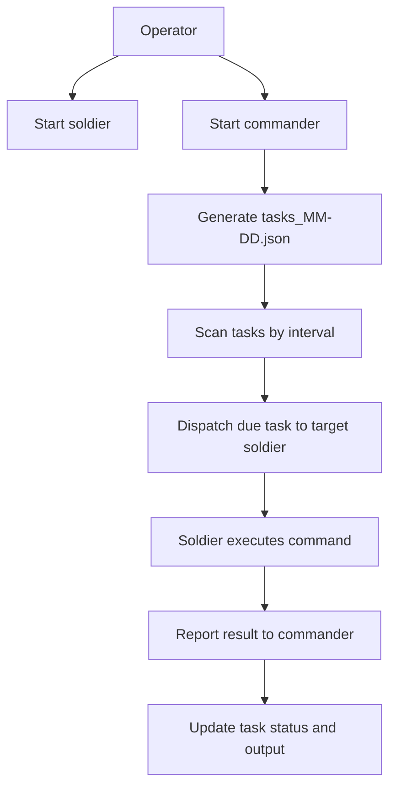

# HolyFramework

HolyFramework 是一个面向企业内网场景的分布式任务执行框架。项目通过 `commander` 生成和调度每日任务，通过 `soldier` 在不同主机上执行任务并回报结果，从而持续产生日常办公型、可观测的业务流量。

当前任务生成链路默认使用 DeepSeek API，但调用层已经抽象到 `commander/agent_request_abc.py`，后续可以继续扩展其它模型实现。领域场景、角色职责和任务模板定义在 `domain_resource.md`，它既是说明文档，也是运行时资源文件。

## 项目做什么

这个项目的目标是模拟一个接近真实的小型企业内网环境，让不同角色在不同主机上执行符合职责的日常任务，持续产生正常、可观测的网络活动。

主要功能包括：

- 自动生成每日角色任务文件，按角色组织全天任务。
- 定时扫描任务计划，到点后自动下发到对应主机。
- 使用 `soldier` 执行命令，并将结果回报给 `commander`。
- 将任务状态、输出、错误信息持续写回统一任务文件。
- 支持手动生成任务、手动下发任务和手动报告结果。
- 通过 `commander.ini` 动态定义角色集合，每个 section 都代表一个角色。
- 通过抽象接口封装模型请求，当前默认实现为 `commander/deepseek_client.py`。

## 工作流程



## 目录结构

```text
HolyFramework/
├── README.md                       # 项目总说明（当前主入口文档）
├── common.py                       # commander 与 soldier 共用的校验、路径、任务格式与提示词工具
├── domain_resource.md              # 领域场景与任务模板资源，任务生成运行时会读取
├── requirements.txt                # Python 依赖
├── commander/
│   ├── commander.py                # commander 主入口：启动 TCP 服务、扫描线程和依赖装配
│   ├── generate_role_task.py       # 独立生成每日任务文件的脚本入口
│   ├── dispatch.py                 # 单次手动下发任务的 CLI
│   ├── dispatch_client.py          # scanner 调用 dispatch.py 的 subprocess 适配层
│   ├── scanner_service.py          # 扫描与调度主流程
│   ├── role_file_service.py        # 每日任务文件的生成、修复、加载、保存
│   ├── role_task_generation.py     # 任务生成编排：prompt、调用模型、校验、落盘
│   ├── agent_request_abc.py        # 模型请求抽象接口与通用响应/异常类型
│   ├── deepseek_client.py          # 当前默认模型实现：DeepSeek API 客户端
│   ├── repository.py               # 任务文件仓储：读写、锁、状态回写
│   ├── domain.py                   # 任务状态流转规则
│   ├── policies.py                 # 任务选择策略（默认选择最早 pending）
│   ├── target_config.py            # 读取 commander.ini 中的角色和目标主机配置
│   ├── runtime_config.py           # 读取并校验 config.json
│   ├── logging_setup.py            # commander/dispatch 日志初始化
│   ├── config.json                 # commander 主配置文件
│   ├── commander.ini               # 角色 -> soldier 主机/端口映射
│   ├── role_task/                  # 每日统一任务文件目录
│   └── logs/                       # commander 和 dispatch 日志目录
├── soldier/
│   ├── soldier.py                  # soldier 主程序：监听任务、执行命令、回报结果
│   ├── soldier.ini                 # soldier 配置文件
│   └── logs/                       # soldier 日志目录
└── tests/
    └── test_commander_refactor.py  # 核心回归测试
```

## 核心概念

### Commander

`commander` 负责生成任务、维护每日任务文件、扫描到点任务并分发给目标 `soldier`。它还负责接收执行结果并把状态写回同一份任务文件。

### Soldier

`soldier` 是任务执行端。它监听来自 `commander` 的 TCP 请求，执行收到的命令，然后把状态、输出和错误信息回报给 `commander`。

### 统一任务文件

每日任务文件位于 `commander/role_task/tasks_MM-DD.json`，按角色组织任务。每个任务项至少包含以下字段：

- `time`
- `is_load`
- `task`
- `task_id`
- `status`
- `issued_at`
- `expiry_time`
- `completed_at`
- `report_message`
- `exit_code`
- `stdout`
- `stderr`

其中状态流转遵循：`planned -> waiting -> successed/failed`。

### 角色来源

角色集合不再写死在代码里，而是来自 `commander/commander.ini` 的 section。比如：

```ini
[hr]
host = 192.168.14.72
port = 38472

[accountancy]
host = 192.168.14.73
port = 38472
```

这表示：

- `hr`、`accountancy` 是两个角色名。
- 每个角色对应一个目标 `soldier` 主机和监听端口。
- 新增或删除角色时，只需要调整 `commander.ini` 的 section。

## 基础使用方法

### 1. 环境依赖

基础依赖来自 `requirements.txt`：

```bash
pip install -r requirements.txt
```

当前 Python 依赖只有：

- `filelock>=3.13.0`
- `colorlog>=6.8.2`

除此之外，还需要：

- Python 3.8+
- 系统上可执行的 `opencode` 命令
- commander 与各 soldier 之间的网络互通

### 2. 配置准备

项目运行前至少需要检查三份配置：

#### `commander/config.json`

这是 commander 的主配置文件，控制监听、扫描、存储、下发、任务生成、路径和日志。当前默认配置包括：

- commander 监听 `0.0.0.0:38471`
- 扫描间隔 `60` 秒
- 任务生成默认使用 DeepSeek：
  - `api_base_url`
  - `api_key`
  - `model`
  - `request_timeout_seconds`

注意：`generator.api_key` 属于敏感信息，不建议长期以明文保存在仓库中。

#### `commander/commander.ini`

用于定义角色与目标主机的映射。每个 section 表示一个角色，每个角色需要：

- `host`
- `port`

#### `soldier/soldier.ini`

用于配置 soldier 的监听地址、上报的 commander 地址和执行超时：

```ini
[commander]
ip = 127.0.0.1
port = 38471

[listen]
bind = 0.0.0.0
port = 38472

[exec]
timeout = 3600
```

### 3. 启动顺序

推荐先启动 `soldier`，再启动 `commander`。

#### 启动 soldier

```bash
cd soldier
python soldier.py listen
```

可选参数：

```bash
python soldier.py listen --bind 0.0.0.0 --listen-port 38472 --commander-host 127.0.0.1 --commander-port 38471
```

#### 启动 commander

```bash
cd commander
python commander.py
```

可选参数：

```bash
python commander.py --host 0.0.0.0 --port 38471 --data-dir ./role_task
```

### 4. 常用辅助命令

#### 手动生成每日任务

```bash
cd commander
python generate_role_task.py
```

#### 手动下发任务

```bash
cd commander
python dispatch.py --target hr --command "opencode run \"使用Exchange查看邮件\"" --task "使用Exchange查看邮件"
```

#### soldier 手动报告结果

```bash
cd soldier
python soldier.py report --task-ref "2026-04-21_hr_a1b2c3d4e5f67890" --status successed --exit-code 0
```

## 进阶使用方法

## commander/config.json 参数说明

### server

控制 commander 的 TCP 监听：

- `host`：监听地址
- `port`：监听端口
- `max_line_bytes`：单条请求最大字节数
- `recv_chunk_bytes`：每次 socket 读取的分块大小
- `socket_timeout_seconds`：连接超时
- `listen_backlog`：监听 backlog

### scanner

控制扫描逻辑：

- `data_dir`：统一任务文件目录
- `scan_interval_seconds`：扫描间隔秒数

### storage

控制任务文件写入与输出保存：

- `lock_timeout_seconds`：文件锁超时
- `max_store_text`：保存 stdout/stderr 的最大字符数

### dispatch

控制任务派发：

- `soldier_timeout_seconds`：`dispatch.py` 连接 soldier 的 TCP 超时
- `client_timeout_seconds`：commander 调用 `dispatch.py` 子进程的超时
- `timeout_minutes`：下发后写入任务的等待过期时间

### generator

控制任务生成：

- `min_tasks_per_role`：每个角色最少任务数
- `max_tasks_per_role`：每个角色最多任务数
- `min_non_five_ratio`：分钟数不是整 5 分钟的最小比例
- `max_attempts`：生成重试次数
- `api_base_url`：模型 API 地址
- `api_key`：模型 API 密钥
- `model`：模型名称
- `request_timeout_seconds`：单次模型请求超时

### paths

控制路径解析。相对路径都是相对于 `commander/` 目录：

- `logs_dir`
- `target_ini_file`
- `dispatch_script`
- `domain_resource_file`

例如，当前 `domain_resource_file` 默认指向 `../domain_resource.md`，所以根目录的 `domain_resource.md` 会在任务生成时被读取。

### logging

控制日志：

- `level`
- `backup_count`
- `rotation_interval_days`

## commander.ini 高级说明

`commander.ini` 不只是“地址表”，它还决定了角色集合本身。

代码中 `commander/target_config.py` 的 `load_all_roles()` 会读取所有 section 名作为角色列表，所以：

- 新增一个 section，就会新增一个角色。
- 删除一个 section，就会从调度和任务生成中移除对应角色。
- section 名会统一转成小写。

## soldier.ini 高级说明

### commander 段

决定 soldier 向哪台 commander 回报结果：

- `ip`
- `port`

### listen 段

决定 soldier 接收任务的监听地址：

- `bind`
- `port`

如果是分布式部署，一般要确保 `bind` 不是只监听本机回环地址，并且端口对 commander 所在主机可达。

### exec 段

决定单次命令执行超时：

- `timeout`

## 参数优先级与覆盖

### commander

`commander.py` 支持以下覆盖：

- `--host` 覆盖 `server.host`
- `--port` 覆盖 `server.port`
- `--data-dir` 覆盖 `scanner.data_dir`

### dispatch

`dispatch.py` 支持以下覆盖：

- `--data-dir` 覆盖 `scanner.data_dir`
- `--timeout-minutes` 覆盖 `dispatch.timeout_minutes`
- `--config` 覆盖 `paths.target_ini_file`

### soldier

`soldier.py` 中命令行参数优先于 `soldier.ini`：

- `--config`
- `listen` 模式下的 `--bind`、`--listen-port`、`--commander-host`、`--commander-port`
- `report` 模式下的 `--host`、`--port`

## 模型生成链路

当前任务生成流程如下：

1. `commander/generate_role_task.py` 或 `RoleTaskFileService` 触发生成。
2. `commander/role_task_generation.py` 读取 `domain_resource.md`，构造 prompt。
3. `commander/deepseek_client.py` 通过 `DeepSeekAgentClient` 调用 DeepSeek API。
4. 返回内容经过 JSON 提取、结构校验和质量校验后落盘为 `tasks_MM-DD.json`。

其中：

- `commander/agent_request_abc.py` 定义了统一的模型请求接口。
- `commander/deepseek_client.py` 是当前默认实现。
- 如果后续增加新的模型客户端，只需要新增实现并注入，不必重写任务生成主流程。

## 日志与运行产物

### commander

日志位于 `commander/logs/`，常见文件包括：

- `commander_YYYY-MM-DD.log`（按自然日切换：周期钩子在日期变化时把 root 文件日志挂到当天文件；`dispatch_*.log` 仍由 `TimedRotatingFileHandler` 在午夜轮转。）
- `dispatch_YYYY-MM-DD.log`
- `agent_output_YYYY-MM-DD.log`
- `agent_responses_YYYY-MM-DD/`

### soldier

日志位于 `soldier/logs/`，文件名通常为：

- `soldier_YYYY-MM-DD.log`（按自然日切换：长期运行时会把 root 文件日志挂到当天文件，不使用轮转后缀。）

除此之外，soldier 还会生成：

- `received_task_MM-DD.jsonl`：任务接收记录
- `output/`：每次执行的 stdout/stderr 落盘文件

## 注意事项

- `domain_resource.md` 是运行时资源文件，不要当成普通说明文档删除。
- `soldier` 会执行收到的命令，建议只在受控环境中部署。
- 分布式部署时，请重点检查 commander 与 soldier 的监听地址、回报地址和防火墙配置。
- 任务时间基于各主机系统时间，跨主机部署时建议保持时钟同步。
- 当前生成器默认使用 DeepSeek API；修改模型配置时，请同步检查 `commander/config.json` 中的 `generator` 段。

## 开发与回归

核心回归测试位于 `tests/test_commander_refactor.py`，可在仓库根目录执行：

```bash
python -m unittest tests.test_commander_refactor
```

如果你要继续扩展项目，建议优先阅读这些代码入口：

- `commander/commander.py`
- `commander/scanner_service.py`
- `commander/role_file_service.py`
- `commander/role_task_generation.py`
- `commander/agent_request_abc.py`
- `soldier/soldier.py`
