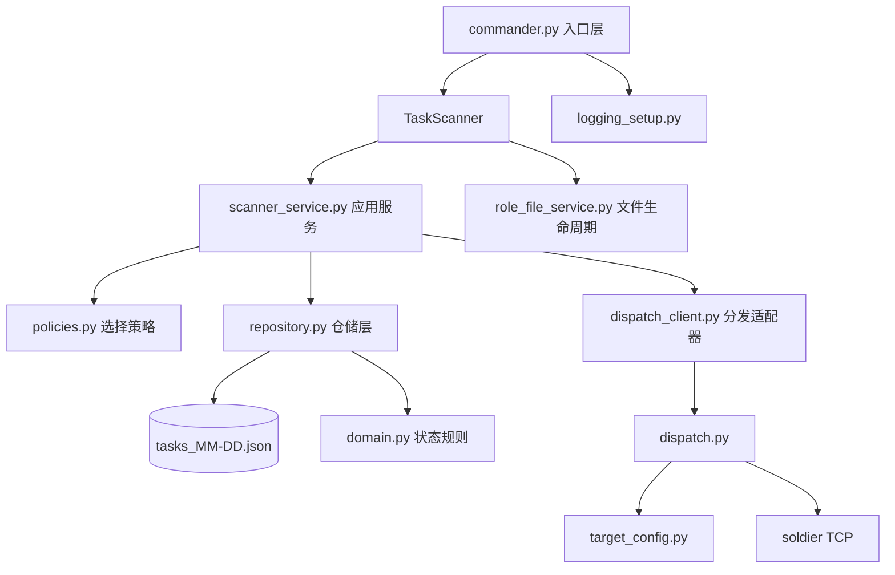

# Commander 架构与依赖说明

## 分层图

## 模块职责

- `commander.py`
  - 仅负责参数解析、日志初始化、服务装配、TCP 接收入口。
- `scanner_service.py`
  - 扫描循环的业务流程：角色遍历、时间判断、等待门控、分发调用。
- `policies.py`
  - 任务选择规则（默认最早 pending）。
- `repository.py`
  - 统一文件读写、锁控制、分发绑定、回报更新。
- `domain.py`
  - 任务状态合法迁移规则。
- `dispatch_client.py`
  - 调用 `dispatch.py` 的适配层，屏蔽 subprocess 细节。
- `role_file_service.py`
  - 每日任务文件的确保、修复、生成、加载、保存。
- `logging_setup.py`
  - 统一日志初始化（console + 按日轮转文件）。
- `target_config.py`
  - 角色目标地址读取（`commander.ini`）。

## 关键依赖方向

- 入口层依赖应用层与基础设施层，不承载业务细节。
- 应用层（scanner_service）依赖抽象策略与仓储/分发接口行为。
- 仓储层依赖领域规则，确保写路径状态合法。
- 分发适配器依赖 `dispatch.py` 命令行约定，不反向耦合扫描流程。

## 状态机

- 合法路径：`planned -> waiting -> successed/failed`
- 非法路径会被仓储层拦截并返回错误，不会写入任务文件。

## 扩展指南

- 新增任务选择规则：在 `policies.py` 新增策略类并替换注入。
- 替换分发通道（如 HTTP/MQ）：新增适配器并在 `TaskScanner` 注入。
- 升级存储（如数据库）：替换 `repository.py` 实现，保持接口语义不变。
